# TraceIQ

A local research assistant that reads your documents and returns structured, cited reports. No API keys. No cloud. Runs entirely on your machine.

[](https://python.org)
[](https://ollama.com)
[](https://fastapi.tiangolo.com)
[](LICENSE)

Upload PDFs, Word docs, PowerPoints, or spreadsheets. Ask a research question. TraceIQ runs a multi-stage retrieval pipeline and returns a structured report with inline citations back to your source documents. Text generation is handled by Ollama, embeddings by sentence-transformers, and vectors are stored in ChromaDB — all locally.


## Pipeline

```mermaid
flowchart LR
    A([User Query]) --> B[Planner Agent\nBreaks the question into focused sub-questions]
    B --> C[Hybrid Retrieval\nSemantic search + BM25 fused via RRF]
    C --> D[Reranker\nScores and filters the top evidence chunks]
    D --> E[Context Builder\nApplies token budget and attaches citation labels]
    E --> F[Synthesizer Agent\nOllama LLM writes the report from retrieved context]
    F --> G[Gap Analysis Agent\nChecks coverage and loops back if needed — max 3 passes]
    G -->|Gaps found| C
    G -->|Complete| H([Structured Report\nSections, claims, and citation map])

    style A fill:#1e1e2e,color:#cdd6f4,stroke:#89b4fa
    style H fill:#1e1e2e,color:#cdd6f4,stroke:#a6e3a1
    style B fill:#313244,color:#cdd6f4,stroke:#89dceb
    style C fill:#313244,color:#cdd6f4,stroke:#89dceb
    style D fill:#313244,color:#cdd6f4,stroke:#89dceb
    style E fill:#313244,color:#cdd6f4,stroke:#89dceb
    style F fill:#313244,color:#cdd6f4,stroke:#89dceb
    style G fill:#313244,color:#cdd6f4,stroke:#f38ba8
```




## Setup

**Prerequisites:** [Ollama](https://ollama.com/download) installed and a model pulled.

```bash
ollama pull mistral
```

Any model works. `llama3`, `phi3`, and `gemma2` are good alternatives.

**Install:**

```bash
git clone https://github.com/your-username/TraceIQ.git
cd TraceIQ
pip install -r requirements.txt
```

To override defaults, copy `.env.example` to `.env` and edit it. This step is optional — the defaults work out of the box.

On Windows, if you encounter `ssl.SSLError: [ASN1] nested asn1 error` during installation, run `pip install certifi`. The application patches this automatically at startup.


## Running

**One-click (Windows):**
```
Double-click start.bat
```

**One-click (Mac/Linux):**
```bash
./start.sh
```

**Manual (two terminals):**

Terminal 1 — backend:
```bash
python -m uvicorn app.api:app --host 0.0.0.0 --port 8000
```

Terminal 2 — open the frontend:
```
Open frontend/index.html in your browser
```

The first time sentence-transformers runs, it downloads the embedding model (~90 MB). Subsequent runs use the local cache.


## Configuration

All settings have working defaults. Copy `.env.example` to `.env` to override any of them.

| Variable | Default | Description |
|---|---|---|
| `OLLAMA_MODEL` | `mistral` | Ollama model to use for generation |
| `OLLAMA_BASE_URL` | `http://localhost:11434` | Ollama server address |
| `OLLAMA_TEMPERATURE` | `0.25` | Generation temperature |
| `OLLAMA_NUM_CTX` | `8192` | Context window in tokens |
| `HF_EMBEDDING_MODEL` | `sentence-transformers/all-MiniLM-L6-v2` | Local embedding model |
| `CHROMA_COLLECTION_NAME` | `research_docs` | ChromaDB collection name |
| `RETRIEVAL_TOP_K` | `10` | Chunks fetched per sub-question |
| `RERANK_TOP_K` | `5` | Chunks retained after reranking |
| `MAX_RESEARCH_ITERATIONS` | `3` | Maximum retrieval loop passes |
| `CONTEXT_TOKEN_BUDGET` | `6000` | Maximum tokens passed to the synthesizer |
| `LOG_LEVEL` | `INFO` | Logging verbosity |


## Project Structure

```
TraceIQ/
├── app/
│   ├── api.py                   # FastAPI backend — all HTTP endpoints
│   ├── main.py                  # CLI entrypoint (alternative to the web UI)
│   ├── config/
│   │   ├── settings.py          # Environment variables and path constants
│   │   └── prompts.py           # LLM prompt templates
│   ├── ingestion/
│   │   ├── embedder.py          # Local sentence-transformers embeddings
│   │   ├── parser.py            # PDF / DOCX / PPTX / CSV parsers
│   │   ├── chunker.py           # Document chunking strategies
│   │   └── indexer.py           # Orchestrates parse → chunk → embed → store
│   ├── vectorstore/
│   │   ├── chroma_store.py      # ChromaDB vector store
│   │   └── bm25_store.py        # BM25 keyword index
│   ├── retrieval/
│   │   ├── hybrid_search.py     # RRF fusion of semantic and keyword results
│   │   ├── reranker.py          # Chunk reranking
│   │   └── context_builder.py   # Token budget and citation label injection
│   ├── agents/
│   │   ├── planner_agent.py     # Decomposes the query into sub-questions
│   │   ├── synthesizer_agent.py # Writes the report from retrieved context
│   │   └── gap_analysis_agent.py# Evaluates coverage and decides whether to loop
│   └── orchestrator/
│       ├── state.py             # LangGraph state schema
│       └── graph.py             # Pipeline graph definition
├── frontend/
│   └── index.html               # Single-file web UI (no framework, no build step)
├── config.py                    # Pydantic configuration models
├── requirements.txt
├── .env.example                 # Copy to .env to override defaults
├── start.bat                    # Windows one-click launcher
├── start.sh                     # Mac/Linux one-click launcher
├── data/
│   ├── uploads/                 # Uploaded documents are stored here
│   └── chroma_db/               # Vector store (auto-created)
├── outputs/                     # Saved report JSON files (auto-created)
└── logs/                        # Log files (auto-created)
```


## API Reference

The backend exposes a REST API on port 8000. Visit `http://localhost:8000/docs` for the interactive Swagger UI.

| Method | Endpoint | Description |
|---|---|---|
| `GET` | `/status` | Returns current configuration and list of uploaded files |
| `POST` | `/upload` | Uploads one or more documents to `data/uploads/` |
| `POST` | `/index` | Parses, chunks, embeds, and indexes uploaded documents |
| `POST` | `/research` | Runs the full pipeline and returns the final report (blocking) |
| `POST` | `/research/stream` | Same as above, but streams progress via Server-Sent Events |
| `GET` | `/reports` | Lists saved report JSON files |
| `GET` | `/reports/{filename}` | Returns the contents of a saved report |
| `DELETE` | `/uploads/{filename}` | Deletes an uploaded file |


## Tech Stack

| Component | Technology |
|---|---|
| Text generation | Ollama (Mistral, LLaMA 3, Phi-3, and others) |
| Embeddings | sentence-transformers (local, no API required) |
| Vector store | ChromaDB |
| Keyword search | rank-bm25 |
| Retrieval fusion | Reciprocal Rank Fusion (RRF) |
| Pipeline orchestration | LangGraph |
| Backend API | FastAPI + uvicorn |
| Frontend | Vanilla HTML/CSS/JS (single file, no build step) |
| Document parsing | pdfplumber, python-docx, python-pptx, openpyxl |


## Troubleshooting

**Backend starts but frontend says "Failed to fetch"**
The backend is not running or crashed on startup. Check the terminal window that opened with `start.bat` for error output.

**`ModuleNotFoundError: No module named 'app'`**
Run uvicorn from the project root, not from inside the `app/` directory:
```bash
python -m uvicorn app.api:app --host 0.0.0.0 --port 8000
```

**Ollama connection error**
Make sure Ollama is running. On Windows it usually starts automatically; on Mac/Linux run `ollama serve` in a separate terminal. Confirm your model is downloaded with `ollama list`.

**Embedding model download hangs**
If your network is restricted, download the model on another machine first:
```bash
python -c "from sentence_transformers import SentenceTransformer; SentenceTransformer('sentence-transformers/all-MiniLM-L6-v2')"
```
Then set `HF_LOCAL_MODEL_PATH` in `.env` to point at the cached folder.

**Context is always empty (0 chunks retrieved)**
Documents must be indexed before querying. Upload files via the sidebar, click "Index Documents", and wait for the confirmation before running a query.

**Port 8000 already in use**
Another process is occupying the port. Find and stop it:
```bash
# Windows
netstat -ano | findstr :8000
taskkill /PID <pid> /F

# Mac/Linux
lsof -i :8000
kill <pid>
```


## Future Improvements

**1. Decider Agent**

Currently, every query is routed through the Planner Agent regardless of whether the question actually requires decomposition into sub-questions. A Decider Agent placed before the Planner would classify the incoming query and determine whether planning is necessary. Simple, direct questions would bypass the planner entirely and go straight to retrieval, reducing latency and unnecessary LLM calls for straightforward lookups.

**2. Scoped Knowledge Base per Query**

At present, the retrieval stage searches across all indexed documents, including those uploaded in previous sessions that may be entirely unrelated to the current query. This can introduce irrelevant context and degrade report quality. The fix involves associating each research session with a specific document scope, so that retrieval is constrained to only the documents the user explicitly selected or uploaded for that query.


## License

MIT — see [LICENSE](LICENSE)
